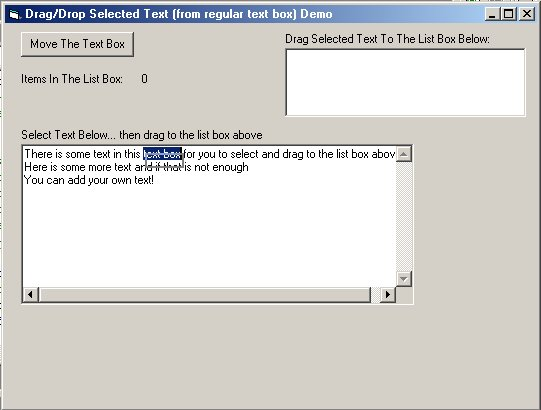



## Drag/Drop Selected Text From VB Text Box

### Description

I was looking for a method for dragging selected text from a regular vb text box to a list box (easily done with a RTB) but couldn't find one on PSC... so here's my simple (but effective) solution.
 
### More Info
 

             |
---                |---
**Submitted On**   |2005-07-18 22:26:48
**By**             |[CptnVic](https://github.com/Planet-Source-Code/PSCIndex/blob/master/ByAuthor/cptnvic.md)
**Level**          |Intermediate
**User Rating**    |5.0 (20 globes from 4 users)
**Compatibility**  |VB 4\.0 \(32\-bit\), VB 5\.0, VB 6\.0
**Category**       |[VB function enhancement](https://github.com/Planet-Source-Code/PSCIndex/blob/master/ByCategory/vb-function-enhancement__1-25.md)
**World**          |[Visual Basic](https://github.com/Planet-Source-Code/PSCIndex/blob/master/ByWorld/visual-basic.md)
**Archive File**   |[Drag\_Drop\_1914927182005\.ZIP](https://github.com/Planet-Source-Code/cptnvic-drag-drop-selected-text-from-vb-text-box__1-61772/archive/master.zip)

